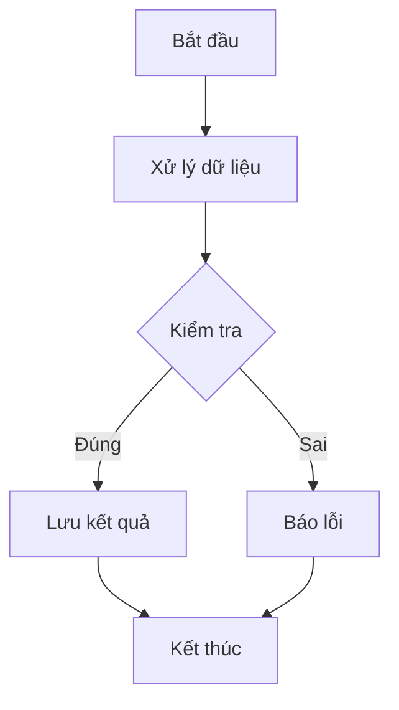

# Biểu đồ trong Chat AI

Thư viện này cho phép hiển thị biểu đồ trong chat AI bằng cách sử dụng Markdown. Có hai loại biểu đồ được hỗ trợ:

1. **Biểu đồ Mermaid**: Để tạo sơ đồ, lưu đồ, biểu đồ trình tự, v.v.
2. **Biểu đồ Dữ liệu (Victory Chart)**: Để hiển thị dữ liệu dưới dạng đồ thị, biểu đồ cột, biểu đồ tròn, v.v.

## Cách sử dụng

### Biểu đồ Mermaid

Sử dụng cú pháp Markdown với khối mã `mermaid` để vẽ biểu đồ:



### Biểu đồ Dữ liệu (Victory Chart)

Sử dụng cú pháp Markdown với khối mã `chart` và định dạng JSON để hiển thị biểu đồ dữ liệu:

```chart
{
  "type": "line",
  "title": "Doanh thu theo tháng",
  "data": [
    {"month": "T1", "value": 1000},
    {"month": "T2", "value": 1500},
    {"month": "T3", "value": 1200},
    {"month": "T4", "value": 1800},
    {"month": "T5", "value": 2000},
    {"month": "T6", "value": 2200}
  ],
  "x": "month",
  "y": "value",
  "theme": "light"
}
```

## Các loại biểu đồ dữ liệu

Thư viện hỗ trợ các loại biểu đồ dữ liệu sau:

### 1. Biểu đồ đường (line)

```chart
{
  "type": "line",
  "title": "Biểu đồ đường",
  "data": [
    {"x": "A", "y": 10},
    {"x": "B", "y": 25},
    {"x": "C", "y": 15},
    {"x": "D", "y": 35},
    {"x": "E", "y": 20}
  ],
  "x": "x",
  "y": "y",
  "theme": "light"
}
```

### 2. Biểu đồ cột (bar)

```chart
{
  "type": "bar",
  "title": "Biểu đồ cột",
  "data": [
    {"category": "Loại A", "count": 42},
    {"category": "Loại B", "count": 28},
    {"category": "Loại C", "count": 35},
    {"category": "Loại D", "count": 16}
  ],
  "x": "category",
  "y": "count",
  "theme": "light"
}
```

### 3. Biểu đồ tròn (pie)

```chart
{
  "type": "pie",
  "title": "Biểu đồ tròn",
  "data": [
    {"label": "Nhóm A", "value": 35},
    {"label": "Nhóm B", "value": 25},
    {"label": "Nhóm C", "value": 20},
    {"label": "Nhóm D", "value": 15},
    {"label": "Nhóm E", "value": 5}
  ],
  "x": "label",
  "y": "value",
  "theme": "light"
}
```

### 4. Biểu đồ vùng (area)

```chart
{
  "type": "area",
  "title": "Biểu đồ vùng",
  "data": [
    {"month": "T1", "value": 150},
    {"month": "T2", "value": 230},
    {"month": "T3", "value": 180},
    {"month": "T4", "value": 290},
    {"month": "T5", "value": 340},
    {"month": "T6", "value": 270}
  ],
  "x": "month",
  "y": "value",
  "theme": "dark"
}
```

### 5. Biểu đồ điểm (scatter)

```chart
{
  "type": "scatter",
  "title": "Biểu đồ điểm",
  "data": [
    {"x": 10, "y": 5, "size": 10},
    {"x": 25, "y": 18, "size": 15},
    {"x": 42, "y": 30, "size": 8},
    {"x": 15, "y": 22, "size": 12},
    {"x": 34, "y": 12, "size": 9}
  ],
  "x": "x",
  "y": "y",
  "theme": "grayscale"
}
```

## Tùy chỉnh màu sắc và theme

### Tùy chỉnh màu sắc

Bạn có thể thêm mảng `colors` để tùy chỉnh màu sắc biểu đồ:

```chart
{
  "type": "line",
  "title": "Biểu đồ với màu tùy chỉnh",
  "data": [
    {"x": "A", "y": 10},
    {"x": "B", "y": 25},
    {"x": "C", "y": 15},
    {"x": "D", "y": 35}
  ],
  "x": "x",
  "y": "y",
  "colors": ["#FF5733", "#33FF57", "#3357FF"]
}
```

### Tùy chỉnh theme

Có 4 theme có sẵn cho biểu đồ:

1. **material** - Theme mặc định của Material Design
2. **grayscale** - Theme với các tông màu xám
3. **light** - Theme sáng tùy chỉnh
4. **dark** - Theme tối tùy chỉnh

```chart
{
  "type": "bar",
  "title": "Biểu đồ với theme tối",
  "data": [
    {"x": "A", "y": 10},
    {"x": "B", "y": 25},
    {"x": "C", "y": 15},
    {"x": "D", "y": 35}
  ],
  "x": "x",
  "y": "y",
  "theme": "dark",
  "colors": ["#7c8cfc", "#a66bfc", "#fc6bfc"]
}
``` 